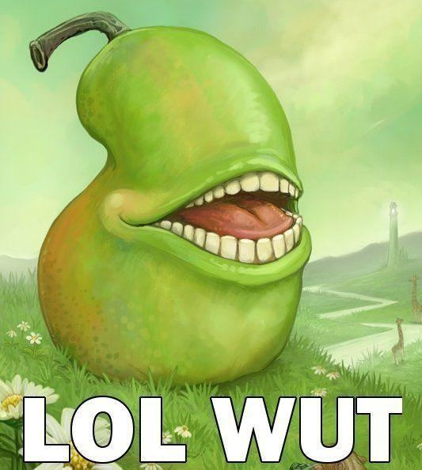

# lintlolwut

Find which Go file golangci-lint is complaining about.

## uh.. no really, what is this?
At work I use `golangci-lint run` to perform static analysis on my Go code. Often the feedback is quite actionable and useful.

Sometimes, however, the feedback is kind of frustratingly obscure. If I am linting hundreds of files, if I get something like this message:

```
Can't run linter goanalysis_metalinter: ST1012: failed prerequisites: config@command-line-arguments"
```
I am left to wonder, what file is it even complaining about?

This little wrapper automates a tedious process I was performing manually. It will  find all the go files in the current directory, optionally match only a subset of them, and run `golangci-lint run` on each file individually. Any that report failures will be called out by name, in addition to any other output.

I hope they improve the feedback to the point that this becomes obsolete.

## Usage

```
Usage of lintlolwut:
  -match string
    	include ONLY files for which filepath includes the string
  -t	include test .go files
  -tags build tags
    	a list of build tags to consider satisfied during the build. For more information about build tags, see the description of build constraints in the documentation for the go/build package
```

### Image Credit
The surrealist painting of the laughing fruit, titled _The Biting Pear of Salamanca_, was posted to deviantART on February 27th, 2006 by Ursula Vernon. Inspired by pop surrealism, she wrote that the pear "lives off low-flying birds, hand-outs, and the occasional unwary sightseer." As early as November 2006[3], a user on 4chan's /b/ (Random) message board had associated the photo with the caption LOLWUT.
